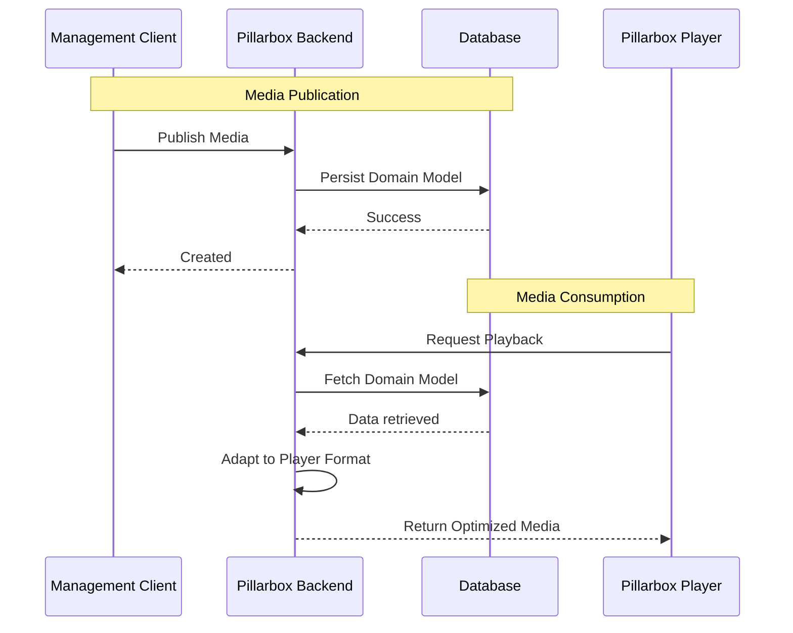

# Pillarbox Demo Backend


Pillarbox Demo Backend is a Kotlin-based service designed to act as the lightweight backbone for
media management within the [Pillarbox](https://pillarbox.ch) ecosystem.

## Quick Guide

**Prerequisites and Requirements**

- **JDK 24** or higher
- **Docker & Docker Compose**: Required for running the local environment. On Linux, follow these
  [post-installation][docker-post-install] steps to allow your user to run Docker commands without
  relying on `sudo`.

### Local Development

Use the convenience script to orchestrate the local environment. This script starts the Docker
containers, launches the background compiler for hot-reloading, and runs the Ktor application.

```bash
# Standard start (cleans up Docker on exit)
./start

# Keep Docker containers running after exiting the app
./start --keep
```

If you prefer to manage the infrastructure and application lifecycles independently, you can
execute the steps separately:

| Step  | Action                   | Command                       |
|-------|--------------------------|-------------------------------|
| **1** | **Start Infrastructure** | `docker compose up -d --wait` |
| **2** | **Start Application**    | `./gradlew run`               |
| **3** | **Cleanup**              | `docker compose down`         |

### Environment Configuration

The application supports externalized configuration via a .env file. This allows you to override
database credentials or point to remote environments without modifying the source code:

1. **Initialize the env file:** `cp .env.example .env`
2. **Customize:** Edit `.env` to match your local or remote setup.

> [!TIP]
> Check the [.env.example](.env.example) for all the supported variables.

### Build & Quality Tools

Use these commands for standard development lifecycle tasks.

| Goal            | Command                        |
|-----------------|--------------------------------|
| **Build**       | `./gradlew build`              |
| **Run Tests**   | `./gradlew test`               |
| **Linting**     | `./gradlew ktlintCheck detekt` |
| **Format Code** | `./gradlew ktlintFormat`       |

### Usage

To get started with the console and API, please refer to
the [Development & API Usage Guide](docs/DEVELOPMENT.md).

## Documentation

This project is a Kotlin-based application built with [Ktor][ktor] and [Koin][koin],
using [Exposed][exposed] and [Flyway][flyway] to manage data persistence in a PostgreSQL database.

### Core Functionality

The service bridges the gap between media management and player consumption through versioned
endpoints:

1. **Management API**: A CRUD interface to publish and organize media metadata using a rich domain
   model.
2. **Player API**: A specialized endpoint that serves media in a format optimized for Pillarbox
   players. This API implements selection logic for streams and DRM based on client preferences.

All player-facing responses are strictly validated against
the [Pillarbox Standard Metadata Schema][pillarbox-schema].

### Data Flow

The following diagram illustrates how the Management and Player APIs interact with the persistence
layer:



### Continuous Integration

This project automates its own development workflow using GitHub Actions:

1. **Quality Check for Pull Requests**
   Triggered on every pull request to the `main` branch, this workflow ensures the code passes
   static analysis and unit tests.

2. **Release Workflow**
   When changes are pushed to `main`, this workflow handles versioning and releases with
   `semantic-release`. It automatically bumps the version, generates release notes, creates a tag,
   and publishes a Docker image to Amazon ECR

## Contributing

Contributions are welcome! If you'd like to contribute, please follow the project's code style and
linting rules. Here are some commands to help you get started:

Check your code style:

```shell
./gradlew ktlintCheck
```

You can try an automatically apply the style by running:

```shell
./gradlew ktlintFormat
```

Detect potential issues:

```shell
./gradlew detekt
```

All commits must follow the [Conventional Commits](https://www.conventionalcommits.org/en/v1.0.0/)
format to ensure compatibility with our automated release system. A pre-commit hook is available to
validate commit messages.

You can set up hook to automate these checks before commiting and pushing your changes, to do so
update the Git hooks path:

```bash
git config core.hooksPath .githooks/
```

Refer to our [Contribution Guide](docs/CONTRIBUTING.md) for more detailed information.

## License

This project is licensed under the [MIT License](LICENSE).

[docker-post-install]: https://docs.docker.com/engine/install/linux-postinstall/
[exposed]: https://jetbrains.github.io/Exposed/
[flyway]: https://flywaydb.org/
[koin]: https://insert-koin.io/
[ktor]: https://ktor.io/
[pillarbox-schema]: src/test/resources/schemas/pillarbox-standard-metadata-schema.json
