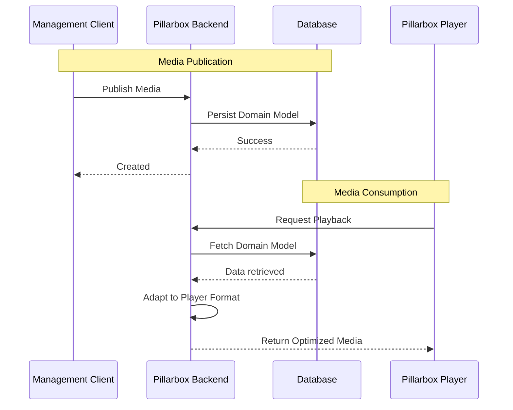

# Pillarbox Demo Backend


Pillarbox Demo Backend is a Kotlin-based service designed to act as the lightweight backbone for
media management within the [Pillarbox](https://pillarbox.ch) ecosystem.

## Quick Guide

**Prerequisites and Requirements**

- **JDK 26** or higher
- **Node.js 24** or higher
- **Docker & Docker Compose**: Required for running the local environment. On Linux, follow these
  [post-installation][docker-post-install] steps to allow your user to run Docker commands without
  relying on `sudo`.

### Using `nvm`

This project includes an `.nvmrc` file that specifies the recommended Node.js version.

If you use `nvm`, you can automatically switch to the correct Node version by running: `nvm use`
If the required version is not installed yet, run: `nvm install`. This will install the Node.js
version defined in `.nvmrc` and switch your shell to use it.

For more details on installing and using the `.nvmrc` file see the official
[`.nvmrc` documentation][nvmrc-doc].

### Local Development

Use the convenience script to orchestrate the local environment. This script starts the Docker
containers, launches the background compiler for hot-reloading, and runs the Ktor application.

```bash
# Standard start (cleans up Docker on exit)
./start

# Keep Docker containers running after exiting the app
./start --keep
```

If you prefer to manage the infrastructure and application lifecycles independently, you can
execute the steps separately:

| Step  | Action                   | Command                       |
|-------|--------------------------|-------------------------------|
| **1** | **Start Infrastructure** | `docker compose up -d --wait` |
| **2** | **Start Application**    | `./gradlew run`               |
| **3** | **Cleanup**              | `docker compose down`         |

To run the full stack as Docker containers only (e.g. for integration testing or CI), use the
`full` profile, which additionally starts the backend service:

```bash
export NODE_VERSION=$(cat .nvmrc)
docker compose --profile full up --build --wait
```

> [!NOTE]
> By default, `docker compose up` only starts the infrastructure services (PostgreSQL and
> Keycloak). The `full` profile is intended for scenarios where you want to validate the
> containerized application without running it locally via Gradle.

### Environment Configuration

The application supports externalized configuration via a .env file. This allows you to override
database credentials or point to remote environments without modifying the source code:

1. **Initialize the env file:** `cp .env.example .env`
2. **Customize:** Edit `.env` to match your local or remote setup.

> [!TIP]
> Check the [.env.example](.env.example) for all the supported variables.

### Build & Quality Tools

Use these commands for standard development lifecycle tasks.

| Goal            | Command                        |
|-----------------|--------------------------------|
| **Build**       | `./gradlew build`              |
| **Run Tests**   | `./gradlew test`               |
| **Linting**     | `./gradlew ktlintCheck detekt` |
| **Format Code** | `./gradlew ktlintFormat`       |

> [!NOTE]
> Tests spin up a throwaway PostgreSQL container via [Testcontainers][testcontainers] and run the
> real Flyway migrations against it, so a running Docker daemon is required.

### Usage

To get started with the console and API, please refer to
the [Development & API Usage Guide](docs/DEVELOPMENT.md).

## Documentation

This project is a Kotlin-based application built with [Ktor][ktor] and [Koin][koin],
using [Exposed][exposed] and [Flyway][flyway] to manage data persistence in a PostgreSQL database.

### Core Functionality

The service bridges the gap between media management and player consumption through versioned
endpoints:

1. **Management API**: A CRUD interface to publish and organize media metadata using a rich domain
   model.
2. **Player API**: A specialized endpoint that serves media in a format optimized for Pillarbox
   players. This API implements selection logic for streams and DRM based on client preferences.

All player-facing responses are strictly validated against
the [Pillarbox Standard Metadata Schema][pillarbox-schema].

### Data Flow

The following diagram illustrates how the Management and Player APIs interact with the persistence
layer:


```mermaid
sequenceDiagram
  participant Admin as Management Client
  participant App as Pillarbox Backend
  participant DB as Database
  participant Player as Pillarbox Player
  Note over Admin, DB: Media Publication
  Admin ->> App: Publish Media
  App ->> DB: Persist Domain Model
  DB -->> App: Success
  App -->> Admin: Created
  Note over Player, DB: Media Consumption
  Player ->> App: Request Playback
  App ->> DB: Fetch Domain Model
  DB -->> App: Data retrieved
  App ->> App: Adapt to Player Format
  App -->> Player: Return Optimized Media
```

### Continuous Integration

This project automates its own development workflow using GitHub Actions:

1. **Quality Check for Pull Requests**
   Triggered on every pull request to the `main` branch, this workflow ensures the code passes
   static analysis and unit tests.

2. **Release Workflow**
   When changes are pushed to `main`, this workflow handles versioning and releases with
   `semantic-release`. It automatically bumps the version, generates release notes, creates a tag,
   and publishes a Docker image to Amazon ECR

## Contributing

Contributions are welcome! Please follow the project's code style and linting rules before
submitting.

| Tool      | Check                   | Fix                      |
|-----------|-------------------------|--------------------------|
| ktlint    | `./gradlew ktlintCheck` | `./gradlew ktlintFormat` |
| detekt    | `./gradlew detekt`      | —                        |
| eslint    | `npm run eslint`        | `npm run eslint:fix`     |
| stylelint | `npm run stylelint`     | `npm run stylelint:fix`  |

All commits must follow the [Conventional Commits](https://www.conventionalcommits.org/en/v1.0.0/)
format to ensure compatibility with our automated release system.

To automate these checks via a pre-commit hook, update the Git hooks path:

```bash
git config core.hooksPath .githooks/
```

Refer to our [Contribution Guide](docs/CONTRIBUTING.md) for more detailed information.

## License

This project is licensed under the [MIT License](LICENSE).

[docker-post-install]: https://docs.docker.com/engine/install/linux-postinstall/
[exposed]: https://jetbrains.github.io/Exposed/
[flyway]: https://flywaydb.org/
[koin]: https://insert-koin.io/
[ktor]: https://ktor.io/
[nvmrc-doc]: https://github.com/nvm-sh/nvm?tab=readme-ov-file#nvmrc
[pillarbox-schema]: src/test/resources/schemas/pillarbox-standard-metadata-schema.json
[testcontainers]: https://testcontainers.com/
